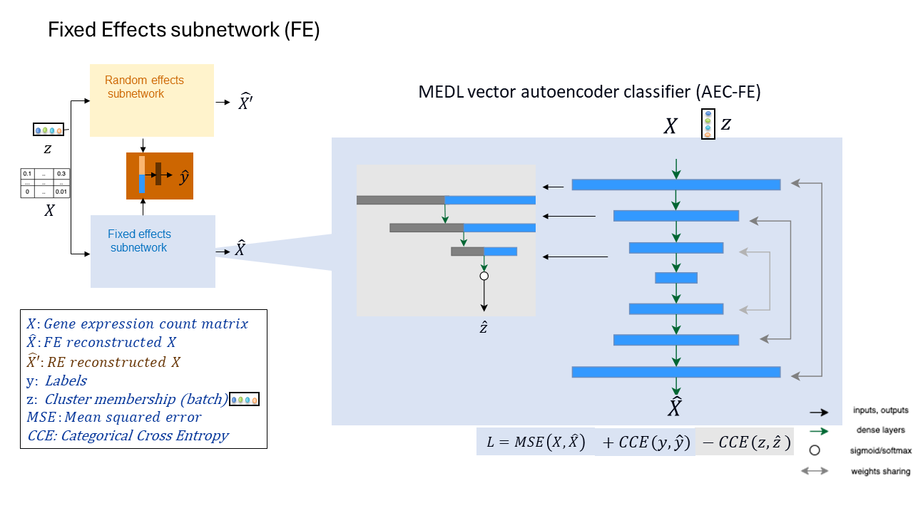
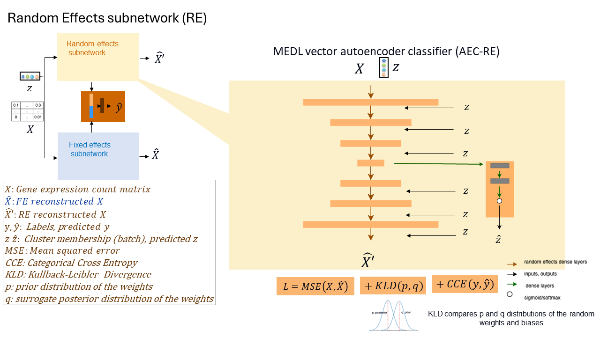
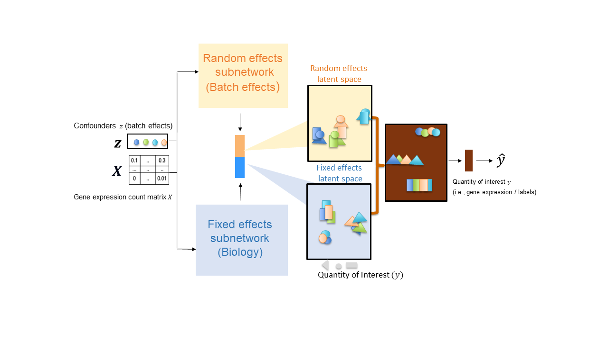

# ARMED_genomics


## Welcome to ARMED Genomics repository

## Description
The goal of this project is to obtain meaningful latent representations from single cell RNA seq data. To obtain this latent space, we will take inspiration from Nguyen et al 2023 and apply an ARMED vector autoencoder to a single cell RNA seq data gene expression matrix, also known as count matrix. 

For the simulation examples, the fixed effects are the celltypes and the random effects are the donors. The random effects are known in the literature as batch effects.

* The inputs are count matrices of size = n cells * m genes.
* The outputs are reconstructed count matrices of the same size than the input.
* The latent space is of size = n cells * p reduced features

## ARMED Framework Overview


The ARMED framework integrates seamlessly with an Autoencoder Classifier (AEC) to process gene expression count matrices (\\(X\\)) and predict cell types (\\(\hat{y}\\)). This framework is designed to enhance the conventional AEC by addressing both predictable and variable batch effects through its dual subnetwork architecture.


### Subnetworks Description

#### Fixed Effects Subnetwork



The Fixed Effects Subnetwork augments the AEC with an adversarial classifier. This configuration aims to refine the model by preventing the prediction of predictable batch effects, thereby improving the accuracy and reliability of the AEC in standardized conditions.

#### Random Effects Subnetwork



The Random Effects Subnetwork extends the AEC by incorporating a design matrix for batch effects into each layer of an autoencoder. It utilizes variational layers where the weight distributions (\(p\)) are optimized to approximate a target distribution (\(q\)), addressing inter-cluster variability effectively. Additionally, this subnetwork includes a classifier specifically designed to ensure the predictability and consistency of batch effects across different datasets.


## Usage

To implement the ARMED framework in your research or applications, ensure that your dataset includes a well-defined gene expression count matrix and corresponding cell type annotations. By leveraging the ARMED model, researchers can achieve more nuanced and robust analyses, crucial for studies involving complex biological datasets. 

For further details on model architecture and implementation, refer to the diagrams provided for each subnetwork. These visual aids will help clarify the operational dynamics and the strategic enhancements made to the traditional AEC model.



### Models
* [AE_v4.py](https://git.biohpc.swmed.edu/s437576/armed_genomics_git/-/blob/main/models/AE_v4.py): Contains models including the simple AEC (Autoencoder Classifier), DA_AE (Domain Adversarial Autoencoder for fixed effects), and the DomainEnhancingAutoencoderClassifier (for Random Effects).
* [random_effects.py](https://git.biohpc.swmed.edu/s437576/armed_genomics_git/-/blob/main/models/random_effects.py): Implements random effects classes, originally developed by Kevin Nguyen for the ARMED paper.

### Utilities
* [utils.py](https://git.biohpc.swmed.edu/s437576/armed_genomics_git/-/blob/main/utils/utils.py)
  * Functions for reading and saving data, plotting, and calculating clustering scores.
* [model_train_utils.py](https://git.biohpc.swmed.edu/s437576/armed_genomics_git/-/blob/main/utils/model_train_utils.py)
  * Functions to load data, build, and train models using configuration information.
* [splitter.py](https://git.biohpc.swmed.edu/s437576/armed_genomics_git/-/blob/main/utils/splitter.py)
  * Function to split data into training, validation, and test sets. Includes support for 5-fold cross-validation.
* [utils_load_model.py](https://git.biohpc.swmed.edu/s437576/armed_genomics_git/-/blob/main/utils/utils_load_model.py)
  * Functions to load previously saved models.

# Experiment Files

## Healthy Heart Data Experiment
Access the Healthy Human Heart dataset utilized in this experiment from [here](https://figshare.com/articles/dataset/Batch_Alignment_of_single-cell_transcriptomics_data_using_Deep_Metric_Learning/20499630/2) (Yu et al., 2023).

### Models
Explore the models used in the Heart Data Experiment:
- **[Run Models Directory](https://git.biohpc.swmed.edu/s437576/armed_genomics_git/-/tree/main/heart_data/run_models)**
  - [Autoencoder (AE)](https://git.biohpc.swmed.edu/s437576/armed_genomics_git/-/tree/main/heart_data/run_models/Healthy_human_heart/log_transformed_3000hvggenes/AE)
  - [Autoencoder Classifier (AEC)](https://git.biohpc.swmed.edu/s437576/armed_genomics_git/-/tree/main/heart_data/run_models/Healthy_human_heart/log_transformed_3000hvggenes/AEC)
  - [Fixed Effects Subnetwork (AEC_DA)](https://git.biohpc.swmed.edu/s437576/armed_genomics_git/-/tree/main/heart_data/run_models/Healthy_human_heart/log_transformed_3000hvggenes/AEC_DA)
  - [Fixed Effects Subnetwork (AE_DA)](https://git.biohpc.swmed.edu/s437576/armed_genomics_git/-/tree/main/heart_data/run_models/Healthy_human_heart/log_transformed_3000hvggenes/AE_DA): This model does not have a classifier.
  - [Random Effects Subnetwork (AE_RE)](https://git.biohpc.swmed.edu/s437576/armed_genomics_git/-/tree/main/heart_data/run_models/Healthy_human_heart/log_transformed_3000hvggenes/AE_RE)

### 5-Fold Cross-Validation
- **[5-Fold Cross-Validation Directory](https://git.biohpc.swmed.edu/s437576/armed_genomics_git/-/tree/main/heart_data/preprocessing/5fold_cross_val)**
  - [Create Splits Notebook](https://git.biohpc.swmed.edu/s437576/armed_genomics_git/-/blob/main/heart_data/preprocessing/5fold_cross_val/create_splits.ipynb): A notebook for splitting data using 5-fold cross-validation.
  - [Config Split Paths Script](https://git.biohpc.swmed.edu/s437576/armed_genomics_git/-/blob/main/heart_data/preprocessing/5fold_cross_val/config_split_paths.py): Manages paths for input data and data splits.
  - [Check Splits Notebook](https://git.biohpc.swmed.edu/s437576/armed_genomics_git/-/blob/main/heart_data/preprocessing/5fold_cross_val/check_splits.ipynb): Ensures no data leakage between training, testing, and validation sets.


# Experiment Configuration

### Model Configuration Script

- **Model Configuration**
  - Each model has its own `model_config.py` file. For an example, see the [AEC model configuration](https://git.biohpc.swmed.edu/s437576/armed_genomics_git/-/blob/main/heart_data/run_models/Healthy_human_heart/log_transformed_3000hvggenes/AEC/model_config.py).
  - This script updates model settings and defines output paths.

Make sure you update your data paths in `model_config.py`:

```python
data_base_path = "path to base path with all variants of the experiment"
scenario_id = "path to specific pre-processing of your experiment"
```

## Construct the Data Paths

- **Path to the data from the experiment you want to run:**

```python
data_path = os.path.join(data_base_path, scenario_id)
```

- **Path to the folder that contains the specific splits (for k-fold cross validation you are running):**

```python
data_seen = os.path.join(data_base_path, scenario_id, 'splits')
print(f"Parent folder: {data_seen}")
```

## Base Output Path

Update the following variable in your script:

```python
outputs_path = "/path/to/outputs"
```

## Folder and Model Naming

Define how you want to name your experiment and the model folder name:

```python
folder_name = "how you want to name your expt"
model_name = "AE_RE"  # the folder name of your output
```

# Script Execution

- **Run Model Across All Folds**
  - Command: `python run_modelname_allfolds.py`
- **Slurm Submission Script**
  - Command: `sbatch sbatch_run_modelname.sh`

### Execution Environment

- The experiments are executed within the ARMED_Aixa_v2 environment.

### Notes

Make sure to change the path to the utils folder in each of the files of the type: `run_modelname_allfolds.py`.
```