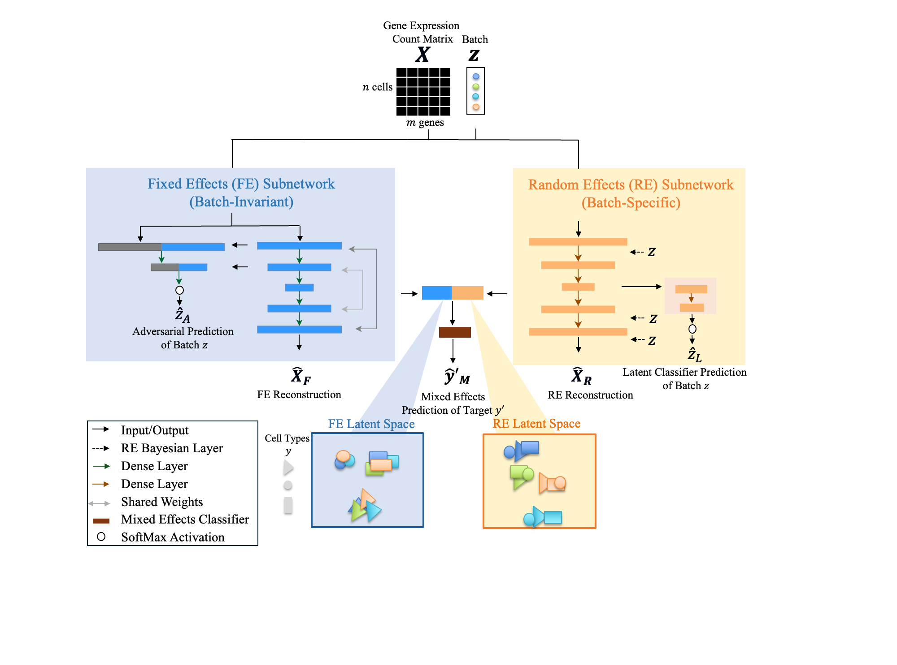

# scMEDAL: Mixed-Effects Deep Autoencoder Learning for scRNA-seq

scMEDAL disentangles **batch-invariant** (fixed effects) from **batch-specific** (random effects) signals to deliver interpretable latent spaces for single-cell RNA-seq analyses.

> For step-by-step replication of the paper results, see **[Experiment Reproducibility Guide](./docs/ExperimentsReproducibility.md#experiment-reproducibility-guide)**.

---

## Quick Start (AML Demo)

We recommend starting with the **Acute Myeloid Leukemia (AML)** demo, the smallest dataset used in the paper. See [**Running the demos.**](#running-the-demos)

1. Open **[`demo/demo_aml.ipynb`](./demo/demo_aml.ipynb)** in Jupyter.
2. We have run it on an NVIDIA **Tesla V100** GPU; expected runtime is **~30 minutes**.
3. The demo uses **quick mode** (see below), so results won't match the full-training manuscript runs.

**Also available:** **[`demo/demo_hh.ipynb`](./demo/demo_hh.ipynb)** and **[`demo/demo_asd.ipynb`](./demo/demo_asd.ipynb)**.


**Before running**, prepare your data as described in the [Datasets](#datasets) section.

> **Default paths** are defined in [**utils/defaults.py**](./utils/defaults.py): inputs load from `./data/` and outputs save to `./outputs/`.

To set up your project path, edit `utils/defaults.py`:

```python
# utils/defaults.py
ROOT_PATH = "/your/project/path"
```

Before running Python scripts or notebooks, you can optionally point the working directory to your project path:

```python
# In a script or notebook cell
import os
os.chdir("/your/project/path")  
```

If your project uses different locations, update the configuration accordingly. See [**Outputs and analysis folders**](#outputs-and-analysis-folders).

---

## Installation

Estimated installation time: ~10 minutes.

```bash
# 1) Clone from GitHub
git clone https://github.com/DeepLearningForPrecisionHealthLab/scMEDAL_for_scRNAseq.git


# 2) Create Conda environment
conda create -n scMEDAL python=3.8.20 -y
conda activate scMEDAL

# 3) Install pip deps (path as appropriate)
pip install -r scMEDAL_env/scMEDAL_requirements.txt

# 4) Launch Jupyter
jupyter notebook   # ensure Jupyter is installed in this environment
```

---

## Repository Structure

```text
scMEDAL_for_scRNAseq/
|-- README.md
|-- __init__.py                       # Make repo importable as a package
|-- UTSW_License.txt
|
|-- analysis/                         # Exploratory analyses and plotting scripts
|   |-- __init__.py
|   |-- analysis.py
|   |-- compare_clustering_scores.py
|   |-- compare_results_umap.py
|   |-- genomap_and_plot.py
|
|-- comparables/                      # Comparable models
|
|-- configs/                          # Config files (runs, plotting, training, etc.)
|   |-- __init__.py
|   |-- configs.py
|   |-- data.py
|   |-- experiment_design.py
|   |-- model.py
|   |-- plot.py
|   |-- scores.py
|   |-- training.py
|   |-- ae.py
|   |-- aec.py
|   |-- mec.py
|   |-- scmedalfe.py
|   |-- scmedalfec.py
|   |-- scmedalre.py
|
|-- data/                             # Place datasets here (see Datasets below)
|
|-- demo/                             # Minimal runnable demos (AML, ASD, Healthy Heart)
|
|-- docs/                             # Project documentation
|
|-- models/                           # Training wrappers + underlying implementations
|   |-- __init__.py
|   |-- models.py                     # Maps names to classes, applies defaults, runs training
|   |-- base.py                       # Base class for cross-validated training
|   |-- ae.py                         # AE wrapper
|   |-- aec.py                        # AEC wrapper
|   |-- mec.py                        # MEC training pipeline (Random Forest on latents)
|   |-- scmedalfe.py                  # scMEDAL-FE wrapper
|   |-- scmedalfec.py                 # scMEDAL-FEC wrapper
|   |-- scmedalre.py                  # scMEDAL-RE wrapper
|   |-- scMEDAL/                      # Core model implementations (AE, AEC, scMEDAL-FE, scMEDAL-FEC, scMEDAL-RE)
|
|-- preprocessing/                    # Preprocessing + 5-fold cross-validation scripts
|
|-- scripts/                          # Original scripts for reproducibility 
|
|-- scMEDAL_env/                      # Conda environment YAML
|
|-- utils/                            # Shared utilities
|   |-- __init__.py
|   |-- callbacks.py                  # Metric tracking during training
|   |-- compare_results_utils.py      # Aggregate/compare results across models
|   |-- defaults.py                   # Config paths per experiment
|   |-- genomaps_utils.py             # GenoMap generation helpers
|   |-- model_train_utils.py          # Train/load helpers
|   |-- preprocessing.py              # Dataset preprocessing routines
|   |-- splitter.py                   # K-fold split utilities
|   |-- utils.py                      # Diverse utils: plotting, clustering score fns
|   |-- utils_load_model.py           # Load trained models
|
|-- outputs/                          # Created automatically (figures, latents, models)
```

---
## Datasets

Place datasets under **`data/`** . Create any missing subfolders.

### How to obtain the data

You have two options:

**A) Preprocess locally**

* Run the dataset-specific preprocessing scripts:

- For AML:
   - **[`1_AML_reader.ipynb`](./preprocessing/AML/preprocessing/1_AML_reader.ipynb)**
   - **[`2-preprocess_AML.py`](./preprocessing/AML/preprocessing/2-preprocess_AML.py)**
- For ASD:
   - **[`preprocess_ASD.py`](./preprocessing/ASD/preprocessing/preprocess_ASD.py)**
- For HH:
   - **[`preprocess_HealthyHeart.ipynb`](./preprocessing/HealthyHeart/preprocessing/preprocess_HealthyHeart.ipynb)**


* Create the 5-fold splits with the notebook:
  `preprocessing/<dataset_name>/5fold_cross_val/1-create_splits.ipynb`

**B) Use preprocessed bundles (scMEDAL's Figshare)**

* Download the preprocessed data and ready-made splits from scMEDAL's Figshare.

* Save into the per-dataset *log_transformed_* folders listed below.

---

### Data folders

#### Healthy Human Heart (HH)

* **Original source:** [Figshare  Yu et al., 2023](https://figshare.com/articles/dataset/Batch_Alignment_of_single-cell_transcriptomics_data_using_Deep_Metric_Learning/20499630/2)
* **Save to** `data/HealthyHeart_data/raw/`
* **Preprocessed (scMEDAL's Figshare)** `data/HealthyHeart_data/log_transformed_3000hvggenes/` *(preprocessed + splits)*

#### Autism Spectrum Disorder (ASD)

* **Original source:** [Autism Cell Atlas (Speir 2021; Velmeshev 2019)](https://autism.cells.ucsc.edu)
* **Save to** `data/ASD_data/norm/`
* **Preprocessed (scMEDAL's Figshare)** `data/ASD_data/log_transformed_2916hvggenes/` *(preprocessed + splits)*

#### Acute Myeloid Leukemia (AML)

* **Original source:** [GEO: GSE116256](https://www.ncbi.nlm.nih.gov/geo/query/acc.cgi?acc=GSE116256)
* **Save to** `data/AML_data/zip_files/`
* **Preprocessed (scMEDAL's Figshare)** `data/AML_data/log_transformed_2916hvggenes/` *(preprocessed + splits)*

---

### Example layout (by dataset)

```
data/
  AML_data/
    adata_merged/                  # Merged (not yet preprocessed)
    zip_files/                     # Downloaded: Raw files from GEO
    log_transformed_2916hvggenes/  # Preprocessed + splits (scMEDAL's Figshare)

  ASD_data/
    norm/                          # log2-normalized data (Velmeshev et al., 2019)
    log_transformed_2916hvggenes/  # Preprocessed + splits (scMEDAL's Figshare)

  HealthyHeart_data/
    raw/                           # Downloaded data (Yu et al., 2023)
    log_transformed_3000hvggenes/  # Preprocessed + splits (scMEDAL's Figshare)
```

> The **`outputs/`** folder is created automatically during training.

---

## Running the Demos

Each demo notebook guides you to:

* Train scMEDAL-FE and scMEDAL-RE models
* Compute clustering scores
* Project **UMAPs** from latent spaces,
* Generate **Genomaps** on reconstructions,
* Run **MEC** (a Random Forest classifier) on latent outputs.

You can run **AE**, **AEC**, **scMEDAL-FE**, **scMEDAL-FEC**, or **scMEDAL-RE** independently.
**MEC** requires latent outputs from one of the above models and **cannot** run standalone.

---

## Training Models

### Implemented models

| Model Class   | Description                               |
| :------------ | :---------------------------------------- |
| `AE`          | Autoencoder                               |
| `AEC`         | Autoencoder Classifier                    |
| `scMEDAL-FE`  | Domain-Adversarial Autoencoder            |
| `scMEDAL-FEC` | Domain-Adversarial Autoencoder Classifier |
| `scMEDAL-RE`  | Domain-Enhancing Autoencoder Classifier   |

> **Custom configs:** When training on other datasets, pass configuration dictionaries via `model_kwargs` and `train_kwargs`.

### Named experiments

| Experiment | Dataset                  | n_clusters | n_pred |
| :--------- | :----------------------- | ---------: | -----: |
| `AML`      | Acute Myeloid Leukemia   |         19 |     21 |
| `ASD`      | Autism Spectrum Disorder |         31 |     17 |
| `HH`       | Healthy Heart            |        147 |     13 |

### Quick mode

* Set `quick=True` in `train_kwargs` to shorten training to **1 fold × 10 epochs**.
* **All demos** uses `quick=True` (10 epochs).
  Manuscript results use **500 epochs** across folds. # Running the AML Dataset for 500 Epochs with Early Stopping (5 folds). Set `quick=False` in `train_kwargs` to run the **full training** (**5-fold × 500 epochs**) with early stopping.


---

## What the Demo Does (Pipeline)

Given a **cells × genes** count matrix, the demo:


1. **Trains** each model per split and **saves**:

   * reconstructed count matrices
   * latent spaces
2. **Computes clustering metrics**:

   * **ASW** (Silhouette)
   * **1/DB** (Davies Bouldin),
   * **CH** (Calinski Harabasz)
3. After training, use the unique **run name** to load saved:

   * clustering scores,
   * latent spaces (for **UMAP**),
   * reconstructions (for **Genomap** visualization).
4. Create UMAP and Genomap visualizations
5. Optionally run **MEC** to compare **scMEDAL-FE** vs **scMEDAL-FE+scMEDAL-RE** classification performance.

---

## Outputs and analysis folders

Running any model creates:

* `figures/`
* `latent_space/`
* `saved_models/`

Each contains a subfolder for the trained model. Example:

```
AML/latent_space/scmedalfe/run_crossval_<run_name>
```

> **Tip:** copy the value of `<run_name>`you    will use it to analyze results.

Update your paths as needed:

```python
model_folder_dict = {
    # "ae": "",
    # "aec": "",
    "scmedalfe": "run_crossval_loss_gen_weight-1_loss_recon_weight-1000_loss_class_weight-1_n_latent_dims-50_layer_units-512-132_scaling-min_max_model_type-scmedalfe_batch_size-512_epochs-500_patience-30_sample_size-10000_2025-10-03_14-27",
    # "scmedalfec": "",
    "scmedalre": "run_crossval_loss_recon_weight-110_loss_latent_cluster_weight-0.1_n_latent_dims-50_layer_units-512-132_scaling-min_max_batch_size-512_epochs-500_patience-30_sample_size-10000_2025-10-03_14-27",
}
```

For a complete description of outputs, see **[Experiment Outputs](./docs/ExperimentOutputs.md)**.

---

## Utilities and Modules

### Utilities (under `utils/`)

* **`utils.py`**   plotting, clustering metrics.
* **`model_train_utils.py`**  training and model-loading helpers.
* **`splitter.py`**  k-fold cross-validation utilities.
* **`callbacks.py`**  tracks clustering metrics during training.
* **`compare_results_utils.py`**  aggregates results across models.
* **`genomaps_utils.py`**  Genomap generation.
* **`preprocessing.py`**  preprocessing routines for datasets.
* **`utils_load_model.py`**  load trained models.
* **`defaults.py`**  configuration paths per experiment.

### Models (under `models/` and `models/scMEDAL/`)

* **Wrappers:** `ae.py`, `aec.py`, `scmedalfe.py`, `scmedalfec.py`, `scmedalre.py`, `mec.py`, plus `base.py` and `models.py` .
* **Core implementations:** `scMEDAL/` contains AEC, Domain-Adversarial AE, and Domain-Enhancing AE Classifier implementations; random-effects layers live alongside these.

---

## Architecture Overview



### Fixed-Effects Subnetwork (scMEDAL-FE)

* Learns **batch-invariant** structure.
* Uses **adversarial learning** to minimize batch-label predictability in the latent space.

### Random-Effects Subnetwork (scMEDAL-RE)

* Models **batch-specific** variability (variational/Bayesian layers).
* Regularizes the latent space to capture batch patterns without overfitting.

---

## Documentation Index

* **Experiment Outputs**  **[docs/ExperimentOutputs.md](./docs/ExperimentOutputs.md)**
* **Experiment Reproducibility Guide**  **[docs/ExperimentsReproducibility.md](./docs/ExperimentsReproducibility.md#experiment-reproducibility-guide)**

---

## References

- scMEDAL's Figshare: Andrade, Aixa X.; Nguyen, Son; Montillo, Albert (2026). scMEDAL: Interpretable Single-Cell Transcriptomics Analysis with Batch Effect Visualization via Deep Mixed-Effects Autoencoder. figshare. Dataset. https://doi.org/10.6084/m9.figshare.28414367
- Litvinukova, M. et al. Cells of the adult human heart. Nature 588, 466-472 (2020).
- van Galen, P. et al. *Single-Cell RNA-Seq Reveals AML Hierarchies Relevant to Disease Progression and Immunity.* Cell 176, 1265?1281.e24 (2019).
- Velmeshev, D. et al. *Single-cell genomics identifies cell type-specific molecular changes in autism.* Science 364, 685?689 (2019).
- Speir, M. L. et al. *UCSC Cell Browser: visualize your single-cell data.* Bioinformatics 37, 4578?4580 (2021).
- Yu, X., Xu, X., Zhang, J., & Li, X. *Batch alignment of single-cell transcriptomics data using deep metric learning.* Nat Commun 14, 960 (2023).  
- Yu, X., Xu, X., Zhang, J., & Li, X. *Batch alignment of single-cell transcriptomics data using deep metric learning.* figshare [https://doi.org/10.6084/m9.figshare.20499630.v2](https://doi.org/10.6084/m9.figshare.20499630.v2) (2023).
- Lopez, R. et al. Deep generative modeling for single-cell transcriptomics. Nat Methods 15, 1053-1058 (2018).
- Xu, C. et al. Probabilistic harmonization and annotation of single-cell transcriptomics data with deep generative models. Mol Syst Biol 17, e9620 (2021).
- Amodio, M. et al. Exploring single-cell data with deep multitasking neural networks. Nat Methods 16, 1139-1145 (2019).
- Hie, B. et al. Efficient integration of heterogeneous single-cell transcriptomes using Scanorama. Nat Biotechnol 37, 685-691 (2019).
- Korsunsky, I. et al. Fast, sensitive and accurate integration of single-cell data with Harmony. Nat Methods 16, 1289-1296 (2019).
- Gayoso, A. et al. A Python library for probabilistic analysis of single-cell omics data. Nat Biotechnol 40, 163?166 (2022). https://doi.org/10.1038/s41587-021-01206-w


---
